# Prepario

**Prepario** is a full-stack web application that helps developers prepare for technical and HR interviews. You run realistic mock interviews tailored to your role and seniority, submit written answers, and receive instant AI-powered feedback with scores, missing points, and suggested improvements.


---

# Live demo: https://prepario-frontend-gmoyv6mtha-ew.a.run.app/

## Table of Contents

- [Overview](#overview)
- [Screenshots](#screenshots)
- [Key Features](#key-features)
- [How It Works](#how-it-works)
- [Architecture](#architecture)
- [Tech Stack](#tech-stack)
- [Project Structure](#project-structure)
- [Getting Started](#getting-started)
  - [Prerequisites](#prerequisites)
  - [Quick Start with Docker](#quick-start-with-docker)
  - [Local Development (without Docker)](#local-development-without-docker)
- [Configuration](#configuration)
  - [Environment Variables](#environment-variables)
  - [AI Evaluator Providers](#ai-evaluator-providers)
  - [OAuth (Google & GitHub)](#oauth-google--github)
- [Authentication](#authentication)
- [API Reference](#api-reference)
- [Question Bank](#question-bank)
- [Testing](#testing)
- [CI/CD & Deployment](#cicd--deployment)
- [Troubleshooting](#troubleshooting)
- [License](#license)

---

## Overview

Interview preparation is most effective when you practice under realistic conditions and get actionable feedback immediately. Prepario combines:

- A **curated question bank** organized by role, level, and interview type
- An **interview session engine** that tracks progress question by question
- **LLM-based evaluation** (Google Gemini or local Ollama) that scores answers on multiple dimensions
- A **React dashboard** for history, statistics, achievements, and profile management

Whether you are preparing for a Python backend role, HR screening, or a mixed interview, Prepario lets you repeat sessions until your weak topics improve.

---

## Screenshots

### Landing page

The public home page introduces the product, shows platform statistics, and links to registration.

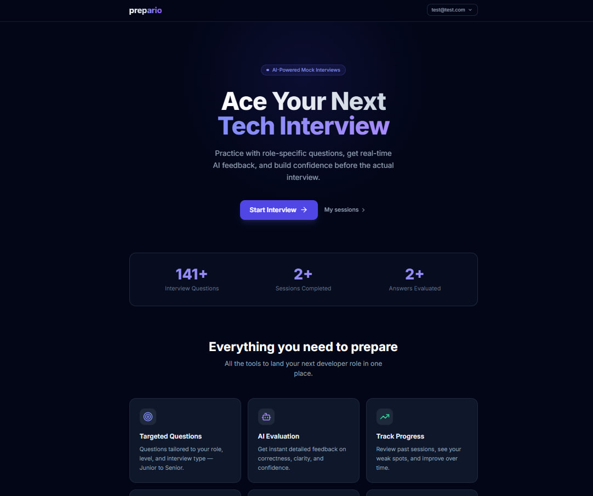

### Registration & login

Email/password sign-up with complexity rules, plus optional OAuth via Google and GitHub.

| Register | Login |
|----------|-------|
| 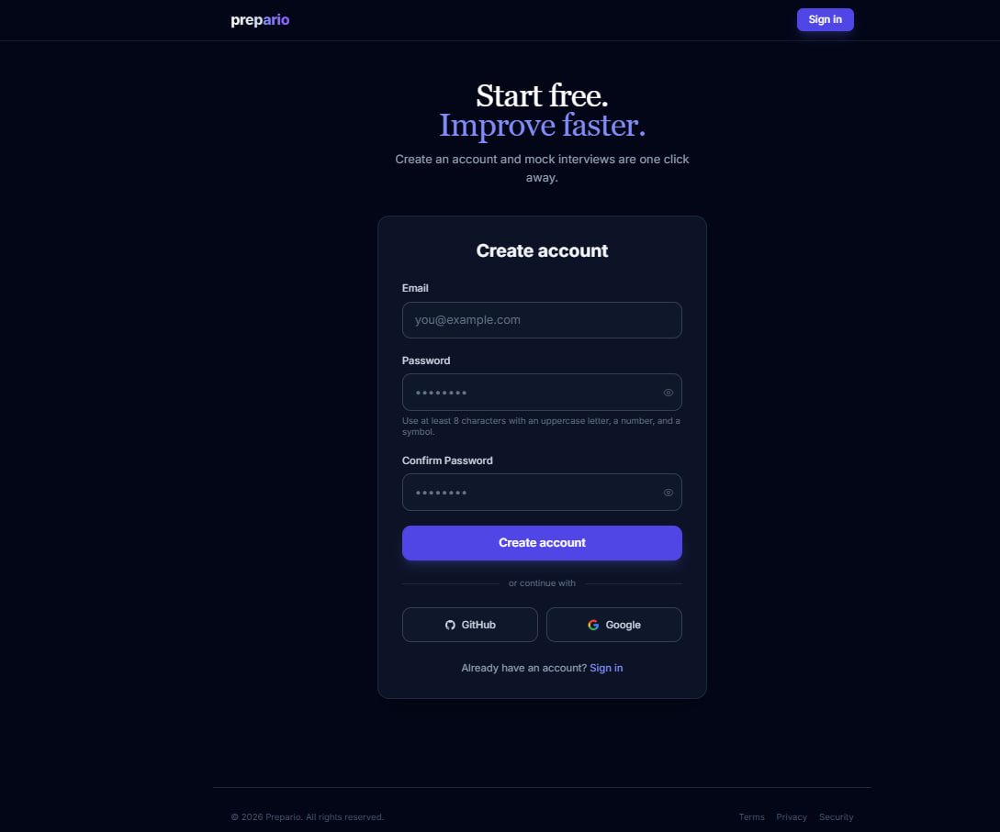 | 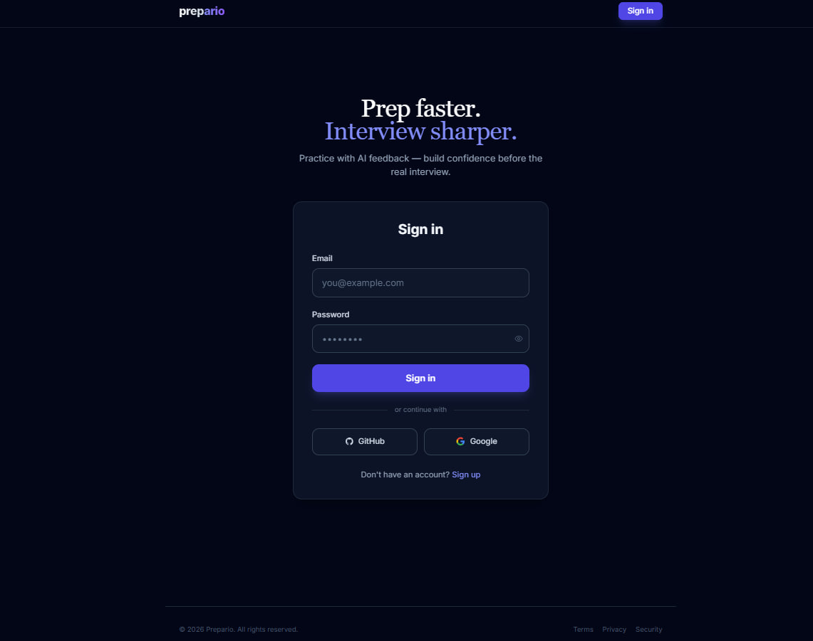 |

### Create interview session

Choose a technology track (e.g. Python Backend, Java, Go), seniority level, interview type, and number of questions.

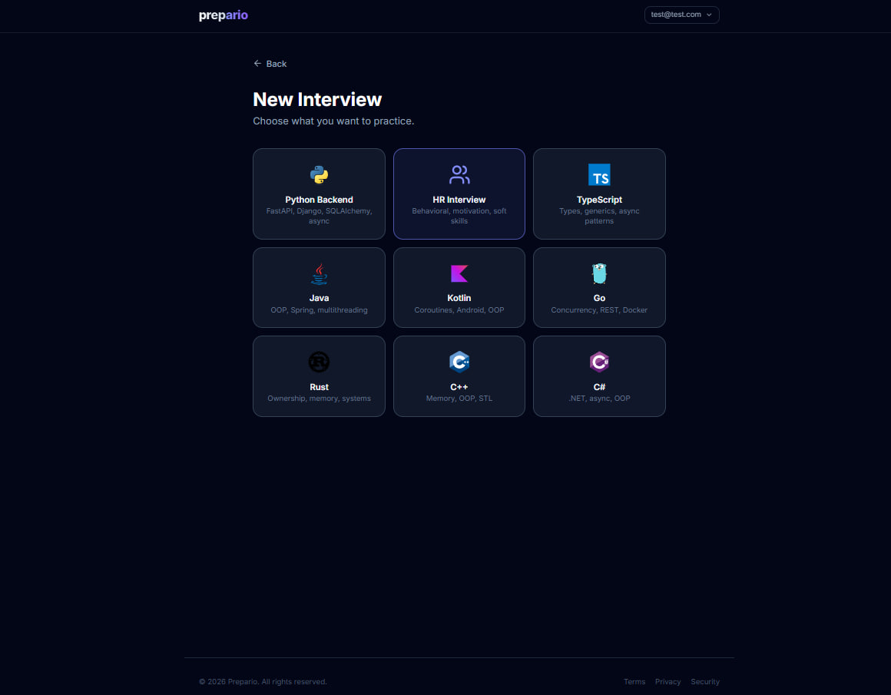

### Active interview

Answer questions one at a time; the UI shows the current question and session progress.

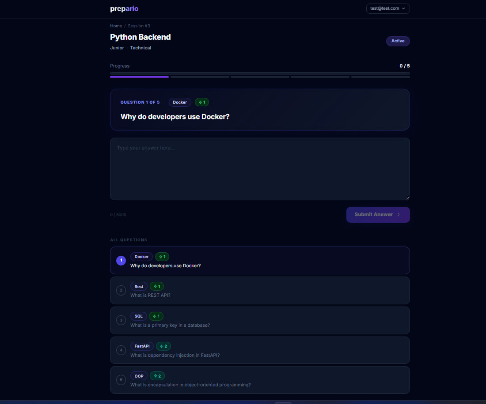

### AI feedback

After each answer, Prepario returns scores (overall, clarity, correctness, confidence), written feedback, missing points, and a better sample answer.

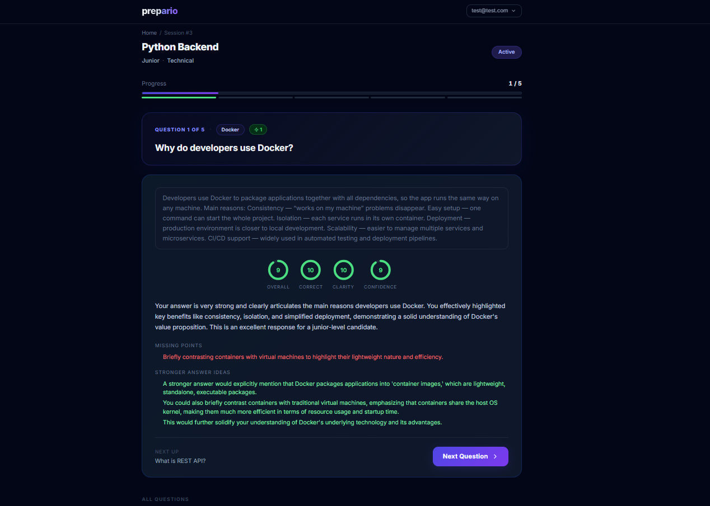

### Dashboard

List of past sessions with status, scores, and quick navigation.

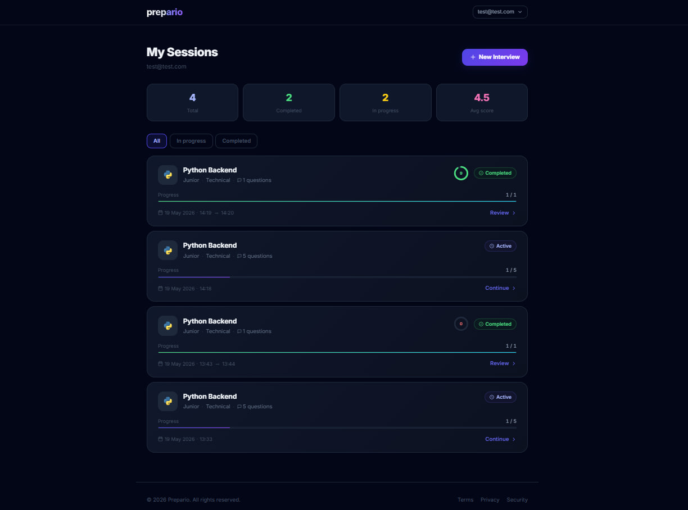

### Profile & statistics

Aggregated stats: average score, activity chart, weak topics, role breakdown, and unlockable achievements.

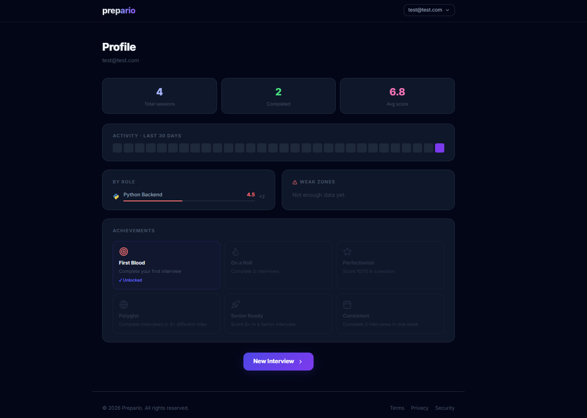

### Settings

Change password or set a password for OAuth-only accounts.

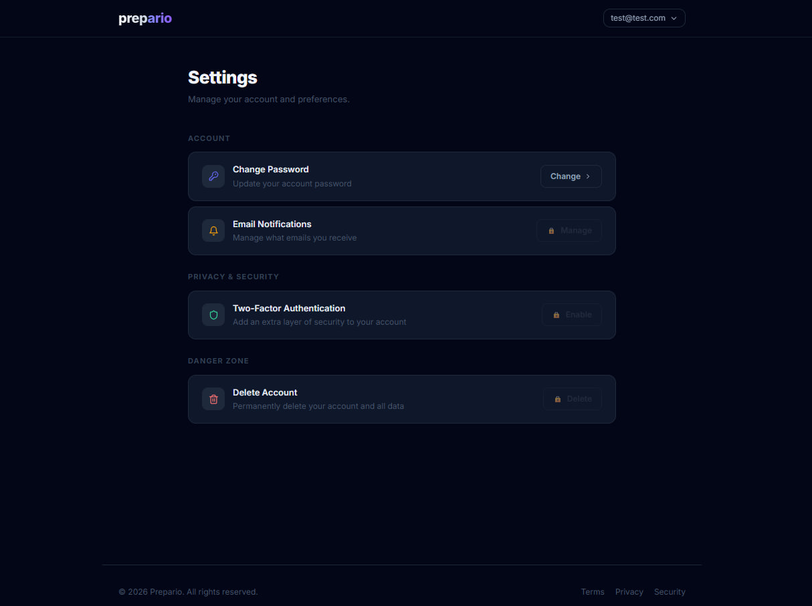

### API documentation (Swagger)

Interactive OpenAPI docs served by the backend.

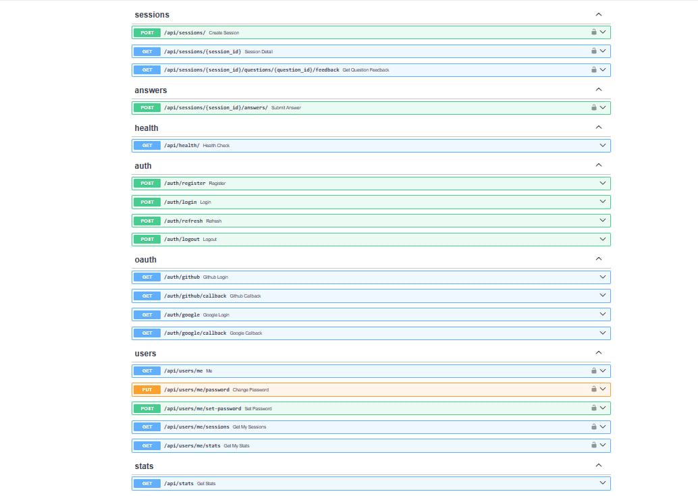

---

## Key Features

### Interview sessions

- **Roles / tracks:** Python Backend, TypeScript, Java, Kotlin, Go, Rust, C++, C#, HR, and more (driven by the question bank)
- **Levels:** Junior, Mid, Senior
- **Interview types:**
  - **Technical** — role-specific technical questions
  - **HR** — behavioral and soft-skill questions
  - **Mixed** — blend of technical and HR (roughly one-third HR)
- **Configurable length:** 1–50 questions per session
- **Session lifecycle:** `active` → `completed` with automatic final score when all questions are answered

### AI evaluation

Each submitted answer is evaluated by an LLM and returns:

| Field | Description |
|-------|-------------|
| `score` | Overall score (0–10) |
| `clarity_score` | How clearly the answer was expressed |
| `correctness_score` | Technical accuracy |
| `confidence_score` | Perceived confidence and structure |
| `feedback_text` | Narrative feedback |
| `missing_points` | List of topics you should have mentioned |
| `better_answer` | Suggestions to improve the response |

### User account & security

- Email/password registration with **Argon2** password hashing
- **JWT access tokens** (Bearer header) + **refresh tokens** in `httpOnly` cookies
- **Refresh token rotation** on every `/auth/refresh` (stolen tokens are revoked after rotation)
- **OAuth 2.0** sign-in with Google and GitHub
- Per-user session isolation — you cannot access another user's interviews
- **Rate limiting** (Redis) on login, register, and answer submission

### Progress tracking

- Personal dashboard with session history and pagination
- Profile stats: totals, averages, per-role breakdown, 30-day activity
- **Weak topics** — topics where your average score is lowest (minimum 2 answers)
- **Achievements:** First Blood, On a Roll, Perfectionist, Polyglot, Senior Ready, Consistent

### Operations

- **Docker Compose** stack: API, frontend (nginx), PostgreSQL, Redis, optional RedisInsight
- **Alembic** database migrations
- Automatic **question bank seeding** on container start
- **pytest** suite (81+ tests) with CI gate before production deploy

---

## How It Works

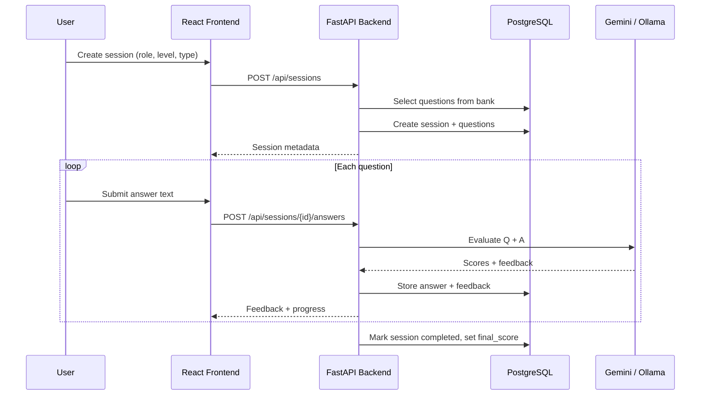

1. **Create session** — `QuestionSelector` picks random questions from `question_bank` matching role, level, and type.
2. **Answer** — User submits text; `InterviewEngine` calls the configured evaluator.
3. **Feedback** — Scores and text are persisted; the session index advances.
4. **Complete** — When all questions are answered, status becomes `completed` and `final_score` is the rounded average of feedback scores.

---

## Architecture

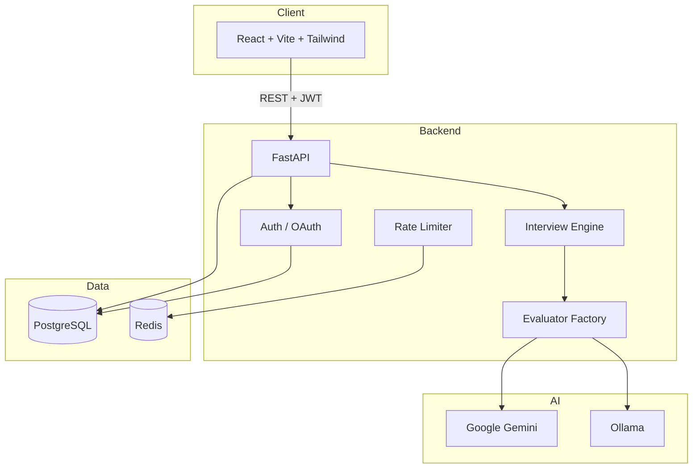

| Service (Docker Compose) | Port | Purpose |
|--------------------------|------|---------|
| `frontend` | 80 | Static React app (nginx) |
| `app` | 8000 | FastAPI API |
| `db` | 5432 | PostgreSQL 16 |
| `redis_container` | 6379 | Rate limiting |
| `redis_gui` | 5540 | RedisInsight (optional) |

---

## Tech Stack

### Backend

| Technology | Role |
|------------|------|
| Python 3.12 | Runtime |
| FastAPI | HTTP API framework |
| SQLAlchemy 2 (async) | ORM |
| asyncpg | PostgreSQL driver |
| Alembic | Migrations |
| Pydantic / pydantic-settings | Validation & config |
| python-jose | JWT |
| argon2-cffi | Password hashing |
| google-genai | Gemini evaluator |
| httpx | HTTP client (Ollama) |
| Redis | Rate limiting |
| structlog | Structured logging |

### Frontend

| Technology | Role |
|------------|------|
| React 18 | UI |
| TypeScript | Type safety |
| Vite | Build tool |
| React Router 6 | Routing |
| Tailwind CSS | Styling |
| Radix UI | Accessible components (slider) |
| lucide-react / devicons-react | Icons |

### Infrastructure

| Technology | Role |
|------------|------|
| Docker & Docker Compose | Local & containerized runs |
| GitHub Actions | Tests + deploy to GCP Cloud Run |
| Google Cloud Run | Production hosting |
| Artifact Registry | Container images |

---

## Project Structure

```
.
├── app/                          # Backend application
│   ├── main.py                   # FastAPI app, CORS, lifespan
│   ├── config.py                 # Settings (env-based)
│   ├── db.py                     # Async SQLAlchemy engine
│   ├── rate_limiter.py           # Redis sliding-window limits
│   ├── auth/
│   │   ├── router.py             # /auth/register, login, refresh, logout
│   │   ├── oauth.py              # /auth/github, /auth/google callbacks
│   │   ├── security.py           # Argon2, JWT helpers
│   │   ├── dependencies.py       # get_current_user, require_role
│   │   └── models.py             # User, RefreshToken
│   ├── models/                   # InterviewSession, Question, Answer, Feedback, QuestionBank
│   ├── routers/
│   │   ├── sessions.py           # Session CRUD + feedback retrieval
│   │   ├── answers.py            # Submit answers
│   │   ├── users.py              # Profile, password, stats, achievements
│   │   ├── stats.py              # Public platform stats
│   │   └── health.py             # Health check
│   ├── schemas/                  # Pydantic request/response models
│   ├── services/
│   │   ├── interview_engine.py   # Session + answer workflow
│   │   ├── question_selector.py  # Bank sampling logic
│   │   └── evaluators/           # Gemini, Ollama, factory
│   └── scripts/
│       └── seed_questions.py     # Load sample_data into DB
├── frontend/                     # React SPA
│   └── src/
│       ├── pages/                # Home, Login, Dashboard, Session, Profile, …
│       ├── api/client.ts         # Typed API client + token refresh
│       └── context/AuthContext.tsx
├── alembic/                      # Database migrations
├── sample_data/
│   └── question_bank.json        # Seed questions
├── tests/                        # pytest (unit + API)
├── docs/screenshots/             # README images (you add these)
├── docker-compose.yml
├── Dockerfile                    # Backend image
├── entrypoint.sh                 # migrate + seed + uvicorn
└── .github/workflows/deploy.yml  # test → build → Cloud Run
```

---

## Getting Started

### Prerequisites

- **Docker** and **Docker Compose** (recommended), **or**
- Python 3.12+, Node.js 18+, PostgreSQL 16, Redis 7
- An **AI provider:**
  - [Google Gemini API key](https://aistudio.google.com/apikey) (`EVALUATOR_PROVIDER=gemini`), **or**
  - [Ollama](https://ollama.com/) running locally (`EVALUATOR_PROVIDER=ollama`)

### Quick Start with Docker

1. **Clone the repository**

   ```bash
   git clone https://github.com/YaroslavDidkiviskiy/ai-interview-simulator.git
   cd ai-interview-simulator
   ```

2. **Configure environment**

   ```bash
   cp .env.example .env
   ```

   Edit `.env` — at minimum set `SECRET_KEY`, `EVALUATOR_PROVIDER`, and either `GEMINI_API_KEY` or Ollama settings. See [Environment Variables](#environment-variables).

3. **Start the stack**

   ```bash
   docker compose up --build
   ```

   On first start, the backend container runs Alembic migrations and seeds the question bank automatically (`entrypoint.sh`).

4. **Open the app**

   | URL | Description |
   |-----|-------------|
   | http://localhost | Frontend (nginx) |
   | http://localhost:8000/docs | Swagger UI |
   | http://localhost:8000/api/health | Health check |
   | http://localhost:5540 | RedisInsight (optional) |

<details>
<summary><strong>Docker Compose stack</strong> (services & ports)</summary>

```
docker-compose.yml
├── db                  → PostgreSQL 16      :5432   (volume: pgdata)
├── redis_container     → Redis 7            :6379   (volume: redis_data)
├── app                 → FastAPI backend    :8000   (depends: db, redis)
├── frontend            → React + nginx      :80     (depends: app)
└── redis_gui           → RedisInsight       :5540   (optional, depends: redis)

# Optional (uncomment for local Ollama instead of Gemini):
# ├── ollama            → Ollama LLM         :11434
# └── ollama-init       → pulls llama3.2:3b on first run
```

| Service | Image / build | Role |
|---------|---------------|------|
| `app` | `Dockerfile` (Python 3.12) | API, migrations, question seed (`entrypoint.sh`) |
| `frontend` | `frontend/Dockerfile` | Static SPA, `VITE_API_URL` at build time |
| `db` | `postgres:16-alpine` | Persistent interview data |
| `redis_container` | `redis:latest` | Rate limiting |
| `redis_gui` | `redis/redisinsight` | Debug Redis (not required) |

```bash
docker compose up --build          # start
docker compose down -v             # stop + remove volumes
docker compose logs -f app         # backend logs
docker compose exec app alembic upgrade head   # manual migrate (usually automatic)
```

</details>

### Local Development (without Docker)

#### Backend

```bash
python -m venv venv
source venv/bin/activate          # Windows: venv\Scripts\activate
pip install -r requirements.txt

# PostgreSQL + Redis must be running; set DATABASE_URL and REDIS_URL in .env
alembic upgrade head
python -m app.scripts.seed_questions

uvicorn app.main:app --reload --host 0.0.0.0 --port 8000
```

#### Frontend

```bash
cd frontend
npm install
# Point API to backend (dev proxy or env)
export VITE_API_URL=http://localhost:8000
npm run dev
```

Vite dev server defaults to http://localhost:5173 — configure `VITE_API_URL` so API calls reach the backend.

---

## Configuration

### Environment Variables

Copy `.env.example` to `.env`. Variables read by the backend (`app/config.py`):

| Variable | Required | Description |
|----------|----------|-------------|
| `APP_NAME` | No | Display name (default: AI Interview Simulator) |
| `DEBUG` | No | `True` disables secure cookies and enables SQL echo |
| `DATABASE_URL` | Yes | Async PostgreSQL URL, e.g. `postgresql+asyncpg://postgres:postgres@db:5432/ai_interview_simulator` |
| `REDIS_URL` | Yes | Redis for rate limiting, e.g. `redis://redis_container:6379/0` |
| `SECRET_KEY` | Yes | JWT signing secret (use a long random string in production) |
| `ACCESS_EXPIRE_MIN` | No | Access token TTL in minutes (default: 30) |
| `REFRESH_EXPIRE_DAYS` | No | Refresh token TTL in days (default: 7) |
| `BACKEND_URL` | Yes* | Public backend URL (OAuth redirects) |
| `FRONTEND_URL` | Yes* | Public frontend URL (CORS + OAuth redirect) |
| `EVALUATOR_PROVIDER` | Yes | `gemini` or `ollama` |
| `GEMINI_API_KEY` | If gemini | Google AI Studio API key |
| `OLLAMA_BASE_URL` | If ollama | Default: `http://localhost:11434` |
| `OLLAMA_MODEL` | If ollama | Default: `llama3.2:3b` |
| `OAUTH_GITHUB_CLIENT_ID` | For GitHub OAuth | GitHub OAuth App client ID |
| `GITHUB_CLIENT_SECRET` | For GitHub OAuth | GitHub OAuth App secret |
| `OAUTH_GOOGLE_CLIENT_ID` | For Google OAuth | Google Cloud OAuth client ID |
| `GOOGLE_CLIENT_SECRET` | For Google OAuth | Google Cloud OAuth client secret |

\*Required for OAuth and production CORS.

**Frontend build (Docker / production):**

| Variable | Description |
|----------|-------------|
| `VITE_API_URL` | Base URL of the API (build arg in `frontend/Dockerfile`) |

### AI Evaluator Providers

Set `EVALUATOR_PROVIDER` to one of:

#### Gemini (recommended for production)

```env
EVALUATOR_PROVIDER=gemini
GEMINI_API_KEY=your-api-key
```

#### Ollama (local / self-hosted)

1. Install and start Ollama.
2. Pull a model:

   ```bash
   ollama pull llama3.2:3b
   ```

3. Configure:

   ```env
   EVALUATOR_PROVIDER=ollama
   OLLAMA_BASE_URL=http://localhost:11434
   OLLAMA_MODEL=llama3.2:3b
   ```

To run Ollama inside Docker Compose, uncomment the `ollama` and `ollama-init` services in `docker-compose.yml`.

### OAuth (Google & GitHub)

1. Create OAuth applications in [Google Cloud Console](https://console.cloud.google.com/) and/or [GitHub Developer Settings](https://github.com/settings/developers).
2. Set authorized redirect URIs to your backend callbacks (e.g. `https://api.example.com/auth/google/callback`).
3. Add client IDs and secrets to `.env` (see table above).
4. Ensure `BACKEND_URL` and `FRONTEND_URL` match your deployed URLs.

After OAuth login, the backend redirects to the frontend with short-lived cookies; the SPA stores the access token and uses the refresh cookie for renewal.

---

## Authentication

### Token model

| Token | Format | Storage | Lifetime |
|-------|--------|---------|----------|
| Access | JWT | `localStorage` + `Authorization: Bearer` | `ACCESS_EXPIRE_MIN` (default 30 min) |
| Refresh | Random string | `httpOnly` cookie + DB row | `REFRESH_EXPIRE_DAYS` (default 7 days) |

**Rotation:** Each call to `POST /auth/refresh` revokes the old refresh token and issues a new one. Reuse of a revoked token fails with `401`.

### Password policy

Registration and password change require:

- Minimum 8 characters
- At least one uppercase letter
- At least one digit
- At least one punctuation symbol

### Auth endpoints

| Method | Path | Description |
|--------|------|-------------|
| `POST` | `/auth/register` | Create account |
| `POST` | `/auth/login` | OAuth2 password form → access token + refresh cookie |
| `POST` | `/auth/refresh` | New access token (requires refresh cookie) |
| `POST` | `/auth/logout` | Revoke refresh token |
| `GET` | `/auth/github` | Start GitHub OAuth |
| `GET` | `/auth/google` | Start Google OAuth |

Protected routes use `get_current_user` and return `401` without a valid access token.

---

## API Reference

Base URL: `http://localhost:8000` (local) or your `BACKEND_URL`.

Interactive docs: **`/docs`** (Swagger), **`/redoc`**.

### Public

| Method | Path | Description |
|--------|------|-------------|
| `GET` | `/api/health/` | `{ "status": "ok" }` |
| `GET` | `/api/stats` | Platform totals (questions, sessions, answers) |

### Sessions (authenticated)

| Method | Path | Description |
|--------|------|-------------|
| `POST` | `/api/sessions/` | Create interview session |
| `GET` | `/api/sessions/{id}` | Session detail + questions + progress |
| `GET` | `/api/sessions/{id}/questions/{qid}/feedback` | Feedback for an answered question |
| `POST` | `/api/sessions/{id}/answers/` | Submit answer → AI feedback |

**Create session body:**

```json
{
  "role": "python_backend",
  "level": "junior",
  "interview_type": "technical",
  "total_questions": 5
}
```

**Submit answer body:**

```json
{
  "question_id": 1,
  "text": "Your answer here…"
}
```

### Users (authenticated)

| Method | Path | Description |
|--------|------|-------------|
| `GET` | `/api/users/me` | Current user profile |
| `PUT` | `/api/users/me/password` | Change password |
| `POST` | `/api/users/me/set-password` | Set password (OAuth-only users) |
| `GET` | `/api/users/me/sessions` | Paginated session history (`?page=1&limit=20`) |
| `GET` | `/api/users/me/stats` | Stats, weak topics, achievements |

### Rate limits (per IP)

| Endpoint group | Limit |
|----------------|-------|
| Login | 3 requests / minute |
| Register | 3 requests / minute |
| Submit answer | 4 requests / minute |

Exceeded limits return **`429 Too Many Requests`**.

---

## Question Bank

Questions live in PostgreSQL table `question_bank`, seeded from `sample_data/question_bank.json`.

Each entry includes:

- `role` — e.g. `python_backend`, `java`, `hr`
- `level` — `junior`, `mid`, `senior`
- `interview_type` — `technical`, `hr`
- `topic`, `difficulty` (1–5), `text`, `is_active`

To re-seed after editing JSON:

```bash
docker compose exec app python -m app.scripts.seed_questions
```

To add questions manually, edit the JSON and re-run the seed script, or insert rows via SQL/admin tool.

---

## Testing

The project uses **pytest** with async support, in-memory SQLite for API tests, **fakeredis** for rate limiter tests, and a **mock LLM evaluator** (no real API calls in CI).

```bash
pip install -r requirements-dev.txt
pytest tests -v
```

| Directory | Contents |
|-----------|----------|
| `tests/unit/` | Security, schemas, selectors, engine, rate limiter, auth deps |
| `tests/api/` | HTTP integration tests for all major routes |
| `tests/conftest.py` | Shared fixtures (DB, client, auth) |

```bash
# Quiet run (as in CI)
pytest tests -q
```

<details>
<summary><strong>Test suite layout</strong> (no screenshots — structure only)</summary>

```
tests/
├── conftest.py              # SQLite in-memory DB, fakeredis, mock LLM, HTTP client
├── factories.py             # User / QuestionBank helpers
├── unit/
│   ├── test_security.py           # Argon2, JWT
│   ├── test_password_validation.py
│   ├── test_schemas.py
│   ├── test_question_selector.py
│   ├── test_rate_limiter.py
│   ├── test_interview_engine.py
│   ├── test_evaluator_factory.py  # Gemini client mocked — no API tokens used
│   └── test_auth_dependencies.py
└── api/
    ├── test_health.py
    ├── test_auth.py
    ├── test_users.py
    ├── test_sessions.py
    ├── test_answers.py
    └── test_stats.py
```

| Area | What is covered |
|------|-----------------|
| Unit | Password rules, selectors, engine, rate limiter, auth deps |
| API | Register/login, sessions, answers, profile stats (mock evaluator) |
| CI | `pytest tests -q` in GitHub Actions **before** deploy — no `GEMINI_API_KEY` required |

</details>

---

## CI/CD & Deployment

GitHub Actions workflow: [`.github/workflows/deploy.yml`](.github/workflows/deploy.yml)

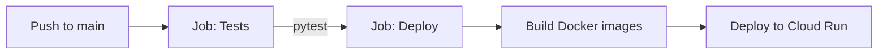

1. **`test`** — Python 3.12, `pip install -r requirements-dev.txt`, `pytest tests -q`
2. **`deploy`** (runs only if tests pass) — Build & push backend/frontend images to GCP Artifact Registry, deploy to **Cloud Run** (`prepario-backend`, `prepario-frontend`)

Required GitHub secrets include `DATABASE_URL`, `REDIS_URL`, `SECRET_KEY`, `GEMINI_API_KEY`, OAuth credentials, `BACKEND_URL`, `FRONTEND_URL`, and GCP workload identity settings.

---

## Troubleshooting

| Problem | Suggested fix |
|---------|----------------|
| `Unsupported evaluator provider` | Set `EVALUATOR_PROVIDER` to `gemini` or `ollama` |
| `Not enough questions` | Seed the bank; check role/level/type match JSON entries |
| `401` on API calls | Log in again; check `SECRET_KEY` unchanged; verify Bearer token |
| `429` on login/answers | Wait for rate limit window; check Redis is reachable |
| OAuth redirect fails | Align `BACKEND_URL`, `FRONTEND_URL`, and provider callback URLs |
| Frontend cannot reach API | Set `VITE_API_URL` at build time; check CORS `FRONTEND_URL` on backend |
| DB connection errors | Wait for Postgres healthcheck; verify `DATABASE_URL` host (`db` in Compose) |
| SQLite vs Postgres in tests | Tests use SQLite in memory; production uses PostgreSQL only |

---

## License

Specify your license here (e.g. MIT). If this repository is private or unlicensed, state that clearly for contributors.

---

<p align="center">
  <strong>Prepario</strong> — practice interviews. Learn from AI feedback. Ship with confidence.
</p>
